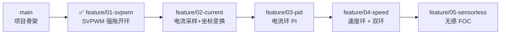

# FOC_Code_Project

[]()
[]()
[]()
[]()
[]()

**STM32G473 永磁同步电机 (PMSM) 磁场定向控制 (FOC) 固件项目**

*STM32G473 Permanent Magnet Synchronous Motor (PMSM) Field-Oriented Control (FOC) Firmware Project*

---

## 📋 目录 / Table of Contents

- [项目简介 / Overview](#项目简介--overview)
- [硬件平台 / Hardware](#硬件平台--hardware)
- [项目结构 / Project Structure](#项目结构--project-structure)
- [构建方法 / Build](#构建方法--build)
- [功能状态 / Feature Status](#功能状态--feature-status)
- [当前实现与限制 / Current Implementation](#当前实现与限制--current-implementation)
- [学习路线 / Learning Roadmap](#学习路线--learning-roadmap)
- [调试工具 / Debug Tools](#调试工具--debug-tools)
- [Git 分支策略 / Branch Strategy](#git-分支策略--branch-strategy)
- [许可证 / License](#许可证--license)

---

## 项目简介 / Overview

本项目是基于 STM32G473 的 FOC（磁场定向控制）电机驱动固件，旨在从零开始逐步实现完整的 PMSM 矢量控制算法，包括 SVPWM、电流环、速度环及无感观测器。

*This project is a FOC (Field-Oriented Control) motor drive firmware based on STM32G473, aiming to progressively implement a complete PMSM vector control algorithm from scratch, including SVPWM, current loop, speed loop, and sensorless observer.*

| 参数 / Parameter | 值 / Value |
|------------------|------------|
| MCU | STM32G473CBTx |
| 内核 / Core | ARM Cortex-M4F (with FPU) |
| 主频 / Clock | 170 MHz |
| Flash | 128 KB |
| RAM | 128 KB |
| PWM 频率 / PWM Freq | 20 kHz (TIM1, center-aligned) |
| 死区时间 / Dead Time | ~235 ns |
| 构建系统 / Build System | CMake + Ninja |
| 工具链 / Toolchain | arm-none-eabi-gcc |

---

## 硬件平台 / Hardware

| 外设 / Peripheral | 功能 / Function | 引脚 / Pins |
|-------------------|-----------------|-------------|
| **TIM1** | 6路互补 PWM (3相桥驱动) / 6-ch Complementary PWM | PA8/PA9/PA10 + PB13/PB14/PB15 |
| **USART1** | 串口调试 / Serial Debug | PB6 (TX), PB7 (RX) |
| **USB (CDC)** | USB 虚拟串口 / Virtual COM Port | PA11 (DM), PA12 (DP) |
| **GPIO** | LED 指示灯 / LED Indicator | PA4 |
| **HSE** | 外部高速晶振 / External Crystal | 25 MHz |
| **ADC1/2** | 电流采样 / Current Sampling | 🔲 待配置 / Pending |

---

## 项目结构 / Project Structure

```
FOC_Code_Project/
├── FOC_Code_Project.ioc        # CubeMX 工程文件 / CubeMX project file
├── CMakeLists.txt              # 顶层 CMake (自定义源码在此添加)
├── CMakePresets.json           # CMake 预设 (Debug / Release)
├── startup_stm32g473xx.s       # 启动文件 / Startup assembly
├── STM32G473xx_FLASH.ld        # 链接脚本 / Linker script
├── cmake/                      # 工具链 & CubeMX 生成的 CMake
│   ├── gcc-arm-none-eabi.cmake # GCC ARM 工具链文件
│   └── stm32cubemx/            # CubeMX 自动生成的 CMake (勿手动改)
├── Core/
│   ├── Inc/                    # HAL 外设头文件
│   │   ├── main.h
│   │   ├── gpio.h
│   │   ├── tim.h
│   │   └── usart.h
│   ├── Src/                    # HAL 外设源文件
│   │   ├── main.c              # 主程序入口
│   │   ├── stm32g4xx_it.c     # 中断服务函数 (TIM1 20kHz FOC 回调)
│   │   ├── tim.c               # TIM1 PWM 配置
│   │   ├── gpio.c
│   │   └── usart.c
│   └── custom_lib/             # 🔧 自定义库 (手写代码)
│       ├── bsp/                # 板级支持包 / Board Support Package
│       ├── debug/              # 调试模块 (VOFA 协议, 11通道/1kHz)
│       ├── system_m4/          # 系统工具 (delay, soft reset, printf)
│       └── foc/                # 🎯 FOC 算法核心 (强拖模式已实现)
├── Drivers/                    # STM32 HAL & CMSIS 库
│   ├── CMSIS/
│   └── STM32G4xx_HAL_Driver/
├── Middlewares/                # ST USB Device 库
└── USB_Device/                 # USB CDC 应用层
```

---

## 构建方法 / Build

### 前置条件 / Prerequisites

- **VS Code** + CMake Tools 扩展
- **arm-none-eabi-gcc** 工具链 / toolchain
- **Ninja** 构建工具 (或 make)

### 步骤 / Steps

```bash
# 1. 克隆仓库 / Clone the repo
git clone https://github.com/YMLGJ/FOC_Code_Project.git
cd FOC_Code_Project

# 2. CMake 配置 (VS Code 中按 Ctrl+Shift+P → CMake: Configure)
#    CMake Configure (in VS Code: Ctrl+Shift+P → CMake: Configure)

# 3. 编译 / Build
#    VS Code: Ctrl+Shift+P → CMake: Build
#    或命令行 / or CLI:
cmake --build build/Debug

# 4. 烧录 / Flash (使用 STM32CubeProgrammer 或 OpenOCD)
```

> ⚠️ 首次克隆后，如果 `cmake/stm32cubemx/` 下缺少文件，请用 CubeMX 打开 `.ioc` 文件并点击 **GENERATE CODE**。

---

## 功能状态 / Feature Status

| 功能 / Feature | 状态 / Status | 分支 / Branch |
|----------------|---------------|---------------|
| HAL 外设初始化 / HAL Peripheral Init | ✅ 完成 / Done | `main` |
| USB CDC 虚拟串口 / Virtual COM Port | ✅ 完成 / Done | `main` |
| VOFA+ 数据可视化 / Data Visualization | ✅ 完成 / Done (11ch @ 1kHz) | `main` |
| TIM1 6路互补 PWM / 6-ch Complementary PWM | ✅ 完成 / Done | `main` |
| SVPWM 开环驱动 / Open-loop Drive | ✅ 完成（强拖）/ Done | `main` |
| 电流采样 + Clarke/Park 变换 / Current Sampling | 🔲 规划中 / Planned | `feature/02-current-sampling` |
| PI 电流环 / Current Loop PI | 🔲 规划中 / Planned | `feature/03-pid-current-loop` |
| 速度环 + 双环级联 / Speed Loop Cascade | 🔲 规划中 / Planned | `feature/04-speed-loop` |
| 无感 FOC (SMO+PLL) / Sensorless FOC | 🔲 规划中 / Planned | `feature/05-sensorless` |

---

## 当前实现与限制 / Current Implementation

### 已实现 / Implemented

- **强拖 FOC**：`Vd=0, Vq=2.5V` 恒定电压矢量，电角度软件积分，频率 0→15Hz 斜坡启动（20Hz/s）
- **SVPWM**：最小-最大零序注入法（等效七段式），20kHz 中心对齐 PWM，死区 ~235ns
- **FOC 中断**：TIM1 更新中断 20kHz，强拖迭代在 `HAL_TIM_PeriodElapsedCallback` 中执行
- **VOFA 调试**：11 通道 / 1kHz 采样率（USB CDC FireWater 协议），含电角度、Vαβ、三相占空比、三相正弦电压
- **当前转速**：128.6 RPM @ 15Hz 电频率（极对数 7）

### 已知限制 / Known Limitations

- 强拖为**开环**，无位置/电流反馈，负载突变会失步，首次上板务必**限流电源 + 空载**
- `FOC_POLE_PAIRS=7`、`FOC_VBUS_DEFAULT=12V` 需按实际电机确认
- 三相理论电流基于 RL 稳态模型（未含反电动势），ADC 电流采样待接入（feature/02）

---

## 学习路线 / Learning Roadmap



### 阶段说明 / Stage Details

| 阶段 / Stage | 核心内容 / Core Content | 验证方式 / Verification |
|--------------|------------------------|------------------------|
| **01 - SVPWM** ✅ | 逆Park + 逆Clarke + 零序注入 SVPWM、频率斜坡强拖 | VOFA 观察三相正弦/马鞍波，电机开环旋转 |
| **02 - Current** | ADC 注入采样、Clarke/Park 变换、电流重构 | VOFA 实时绘制 Id/Iq 波形 |
| **03 - PI Loop** | PI 控制器离散化、参数整定、电流闭环 | Id=0 控制，电机平稳旋转 |
| **04 - Speed** | 编码器测速、速度环 PI、双环级联 | 阶跃响应测试，转速跟踪 |
| **05 - Sensorless** | 滑模观测器 (SMO)、PLL 锁相环、IF 启动 | 无编码器全速域运行 |

---

## 调试工具 / Debug Tools

### VOFA+ 实时数据可视化 / Real-time Visualization

本项目使用 [VOFA+](https://www.vofa.plus/) 协议通过 USB CDC 发送实时浮点数据。

*This project uses the [VOFA+](https://www.vofa.plus/) protocol to send real-time float data via USB CDC.*

```c
// debug.h - 数据帧结构 / Data frame structure
typedef struct {
    float fdata[11];             // 11 通道浮点数据 / 11-channel float data
    const unsigned char tail[4]; // 尾帧: {0x00, 0x00, 0x80, 0x7f}
} VOFA_Send_Handle_t;
```

**通道映射 / Channel Map:**

| 通道 / Ch | 变量 / Variable | 含义 / Meaning |
|-----------|-----------------|----------------|
| 0 | `theta_elec` | 电角度 / Electrical angle [rad] |
| 1 | `V_alpha` | α 轴电压 / α-axis voltage [V] |
| 2 | `V_beta` | β 轴电压 / β-axis voltage [V] |
| 3~5 | `Ta/Tb/Tc` | 三相占空比（马鞍波）/ 3-phase duty (saddle) |
| 6 | `current_freq` | 当前电频率 / Current elec. freq [Hz] |
| 7 | `target_freq` | 目标电频率 / Target elec. freq [Hz] |
| 8~10 | `Va/Vb/Vc_sin` | 三相正弦电压（零序注入前）/ 3-phase sine voltage |

**使用步骤 / Usage:**
1. 用 USB 连接开发板到 PC / Connect board to PC via USB
2. 打开 VOFA+ → 选择串口 → 选择 `FireWater` 协议
3. 在波形窗口中拖入数据通道即可实时观察

*(Open VOFA+ → Select COM port → FireWater protocol → Drag channels to waveform)*

### USART1 printf

```c
printf("Hello from STM32G473!\r\n");  // 输出到 PB6 (TX)
```

---

## Git 分支策略 / Branch Strategy

```
main                     ← 稳定版本 / Stable releases
├── feature/01-svpwm     ← SVPWM 开环 (✅ 已并入 main)
├── feature/02-current   ← 电流采样
├── feature/03-pid       ← 电流环 PI
├── feature/04-speed     ← 速度环
└── feature/05-sensorless← 无感 FOC
```

**提交信息规范 / Commit Convention:**

```
feat(foc): implement SVPWM sector calculation
fix(tim): correct dead-time register value
perf(dsp): use CMSIS-DSP arm_sin_cos_f32
refactor(foc): extract PI controller as generic module
docs(readme): update build instructions
```

**标签 / Tags:**

| Tag | 里程碑 / Milestone |
|-----|-------------------|
| `v0.1-svpwm` | ✅ SVPWM 开环验证通过（强拖模式已实现） |
| `v0.2-current` | 电流采样 + 坐标变换 |
| `v0.3-current-loop` | 电流环 PI 闭环 |
| `v0.4-dual-loop` | 速度+电流双环 |
| `v0.5-sensorless` | 无感 FOC 完整实现 |
| `v1.0-stable` | 稳定发布版 |

---

## 许可证 / License

本项目自定义代码采用 **MIT License**。

STM32 HAL/CMSIS 驱动代码版权归 STMicroelectronics 所有。

*Custom code in this project is licensed under MIT License.*  
*STM32 HAL/CMSIS driver code is copyright STMicroelectronics.*

---

*Made with ❤️ for FOC learning | 为 FOC 学习而生*